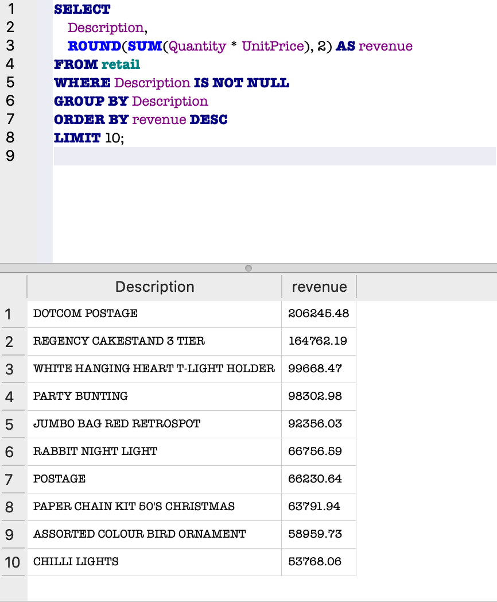

📊 SQL Retail Sales Analysis

📌 Project Overview

This project analyzes retail transaction data using SQL to uncover key business insights related to revenue distribution, customer behavior, product performance, and sales trends over time.

The goal is to demonstrate real-world data analysis skills including aggregation, filtering, grouping, and transforming messy date formats into usable time-series data.

---

🗂️ Dataset

The dataset contains retail sales transactions with the following fields:

- InvoiceNo
- StockCode
- Description
- Quantity
- InvoiceDate
- UnitPrice
- CustomerID
- Country

---

🔍 Key Analysis

🌍 1. Revenue by Country

```sql
SELECT 
    Country,
    ROUND(SUM(Quantity * UnitPrice), 2) AS revenue
FROM retail
GROUP BY Country
ORDER BY revenue DESC
LIMIT 10;
```

📊 Output:


💡 Insights:

- The United Kingdom generates the overwhelming majority of revenue
- Revenue is highly concentrated in a single market
- Other countries contribute significantly less, indicating limited global reach

---

👥 2. Top Customers by Revenue

```sql
SELECT 
    CustomerID,
    ROUND(SUM(Quantity * UnitPrice), 2) AS revenue
FROM retail
WHERE CustomerID IS NOT NULL
GROUP BY CustomerID
ORDER BY revenue DESC
LIMIT 10;
```

📊 Output:


💡 Insights:

- A small number of customers drive a large portion of total revenue
- Indicates strong customer concentration
- Highlights the importance of retention and targeting high-value customers

---

📅 3. Monthly Revenue Trend

```sql
SELECT 
    '20' || substr(
        InvoiceDate,
        instr(InvoiceDate, '/') + instr(substr(InvoiceDate, instr(InvoiceDate, '/') + 1), '/') + 1,
        2
    )
    || '-' ||
    printf('%02d', CAST(substr(InvoiceDate, 1, instr(InvoiceDate, '/') - 1) AS INTEGER)) AS month,

    ROUND(SUM(Quantity * UnitPrice), 2) AS revenue

FROM retail
GROUP BY month
ORDER BY month;
```

📊 Output:


💡 Insights:

- Revenue trends upward over time, indicating business growth
- Noticeable spikes suggest seasonal demand patterns
- Later months show stronger performance, possibly driven by holidays

---

🛍️ 4. Top Products by Revenue

```sql
SELECT 
    Description,
    ROUND(SUM(Quantity * UnitPrice), 2) AS revenue
FROM retail
WHERE Description IS NOT NULL
GROUP BY Description
ORDER BY revenue DESC
LIMIT 10;
```

📊 Output:



💡 Insights:

- A small number of products generate the majority of revenue
- Identifies best-selling items for optimization and marketing
- Highlights opportunities for inventory and pricing strategies

---

🧠 Key Findings

- Revenue is heavily concentrated in the United Kingdom
- A small group of customers contributes a large share of total sales
- Sales trends show consistent growth with signs of seasonality
- A limited number of products drive the majority of revenue

---

📊 Dashboard

"Dashboard" (images/dashboard.png)

This dashboard provides a high-level overview of:

- Revenue by country
- Monthly revenue trends
- Top customers

It helps visualize key performance drivers and business trends.

---

🚀 Tools Used

- SQL (SQLite)
- DB Browser for SQLite
- Tableau Public
- GitHub

---

📈 Project Value

This project demonstrates:

- Writing real-world SQL queries
- Aggregating and analyzing transactional data
- Cleaning and transforming non-standard date formats
- Performing customer and product-level analysis
- Building a dashboard to visualize insights
- Communicating findings clearly with visuals

---

📁 Project Structure

```
sql-retail-sales-analysis/
│
├── README.md
├── queries.sql
└── images/
    ├── revenue-by-country-top10.png
    ├── top-customers-by-revenue.png
    ├── monthly-revenue.png
    ├── top-products-by-revenue.png
    └── dashboard.png
```
