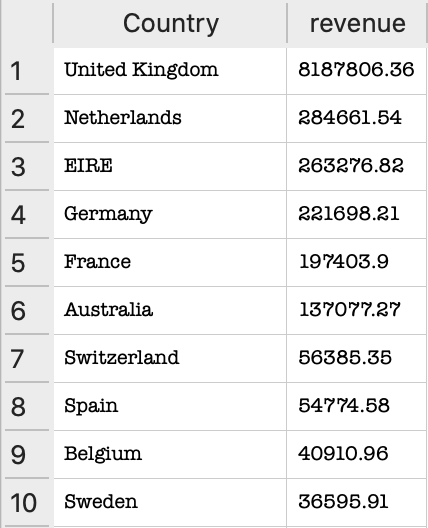

# 📊 SQL Retail Sales Analysis

## 📌 Overview
This project analyzes retail transaction data using SQL to uncover key business insights around revenue, customers, and geographic performance.

The goal is to simulate real-world business analysis by transforming raw transactional data into actionable insights.

---

## 📂 Dataset
The dataset contains retail transaction data including:

- Country
- CustomerID
- Quantity
- UnitPrice
- InvoiceDate

---

## 🧠 Key Analysis

### 1. Revenue by Country

```sql
SELECT 
    Country,
    ROUND(SUM(Quantity * UnitPrice), 2) AS revenue
FROM retail
GROUP BY Country
ORDER BY revenue DESC
LIMIT 10;
```

---

## 📸 Sample Output



---

## 💡 Business Insights

- The United Kingdom generates the overwhelming majority of total revenue  
- Revenue is highly concentrated in a single market, with the UK contributing over 90% of total sales  
- Secondary markets such as the Netherlands and EIRE generate revenue, but at a much smaller scale  
- The steep drop-off after the UK indicates limited international market penetration  

---

## 📌 Key Finding

The business is heavily dependent on the United Kingdom, creating both a major strength and a potential risk due to lack of diversification.

---

## 💡 Recommendations

- Expand marketing efforts in high-performing secondary markets  
- Investigate why the UK significantly outperforms other regions (pricing, logistics, demand)  
- Diversify revenue streams across multiple countries to reduce risk  

---

## 👥 Customer Analysis

### 2. Top Customers by Revenue

```sql
SELECT 
    CustomerID,
    ROUND(SUM(Quantity * UnitPrice), 2) AS revenue
FROM retail
GROUP BY CustomerID
ORDER BY revenue DESC
LIMIT 10;
```

---

## 🚀 Next Steps

- Perform customer segmentation (high-value vs low-value customers)  
- Analyze product-level performance  
- Build a dashboard in Tableau or Power BI for visualization  

---

## 📈 Project Value

This project demonstrates the ability to:

- Write SQL queries to analyze large datasets  
- Transform raw data into meaningful business insights  
- Think critically about business performance and strategy  
- Communicate findings clearly
