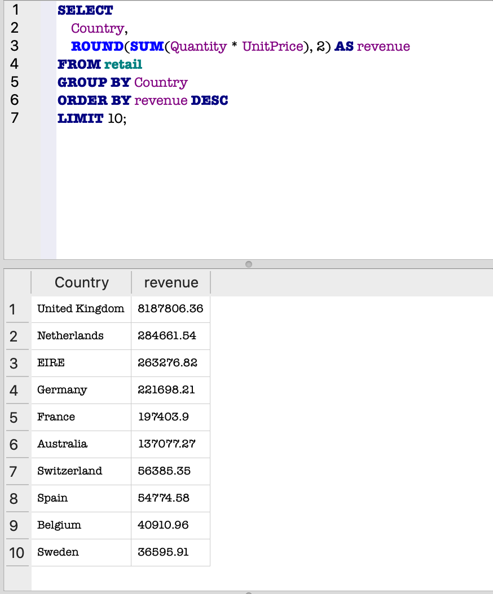
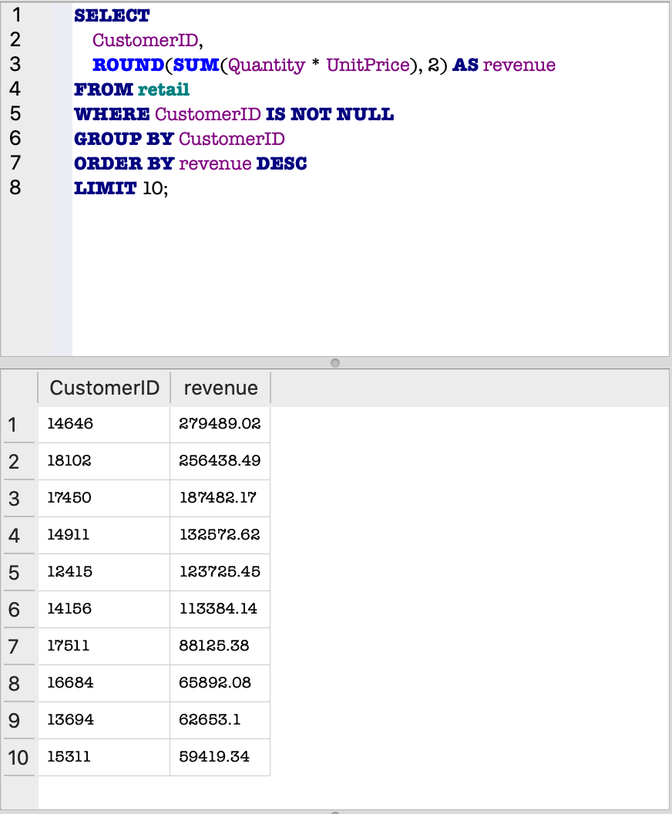
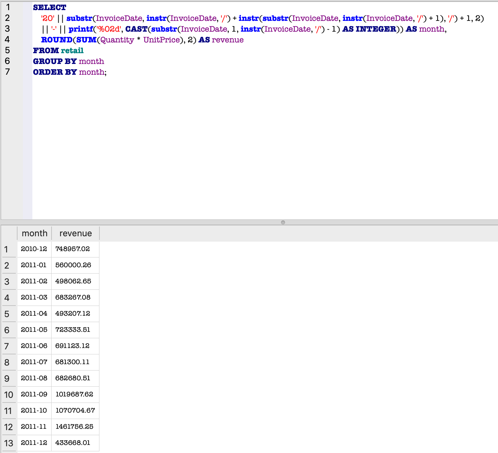

📊 SQL Retail Sales Analysis

📌 Project Overview

This project analyzes retail transaction data using SQL to uncover key business insights related to revenue distribution, customer behavior, and sales trends over time.

The objective is to demonstrate real-world data analysis skills including aggregation, filtering, grouping, and handling messy date formats.

---

🗂️ Dataset

The dataset contains retail sales transactions with the following fields:

- InvoiceNo
- StockCode
- Description
- Quantity
- InvoiceDate
- UnitPrice
- CustomerID
- Country

---

🔍 Key Analysis

🌍 1. Revenue by Country

```sql
SELECT 
    Country,
    ROUND(SUM(Quantity * UnitPrice), 2) AS revenue
FROM retail
GROUP BY Country
ORDER BY revenue DESC
LIMIT 10;
```

📊 Output:



💡 Insights:

- The United Kingdom generates the overwhelming majority of revenue
- Revenue is highly concentrated in a single market
- Other countries contribute significantly less, indicating limited global distribution

---

👥 2. Top Customers by Revenue

```sql
SELECT 
    CustomerID,
    ROUND(SUM(Quantity * UnitPrice), 2) AS revenue
FROM retail
WHERE CustomerID IS NOT NULL
GROUP BY CustomerID
ORDER BY revenue DESC
LIMIT 10;
```

📊 Output:



💡 Insights:

- A small number of customers drive a large portion of total revenue
- Indicates strong customer concentration
- Highlights the importance of retention and high-value customer targeting

---

📅 3. Monthly Revenue Trend

```sql
SELECT 
    '20' || substr(
        InvoiceDate,
        instr(InvoiceDate, '/') + instr(substr(InvoiceDate, instr(InvoiceDate, '/') + 1), '/') + 1,
        2
    )
    || '-' ||
    printf('%02d', CAST(substr(InvoiceDate, 1, instr(InvoiceDate, '/') - 1) AS INTEGER)) AS month,

    ROUND(SUM(Quantity * UnitPrice), 2) AS revenue

FROM retail
GROUP BY month
ORDER BY month;
```

📊 Output:



💡 Insights:

- Revenue trends upward over time, indicating business growth
- Noticeable spikes suggest seasonal demand patterns
- Later months show stronger performance, possibly driven by holidays or scaling

---

🧠 Key Findings

- Revenue is heavily concentrated in the United Kingdom
- A small group of customers contributes a large share of total sales
- Sales trends show growth over time with potential seasonality

---

🚀 Tools Used

- SQL (SQLite)
- DB Browser for SQLite
- GitHub

---

📈 Project Value

This project demonstrates:

- Writing real-world SQL queries
- Aggregating and analyzing transactional data
- Cleaning and transforming non-standard date formats
- Identifying business insights from raw datasets
- Presenting results clearly with visuals

---

📁 Project Structure

sql-retail-sales-analysis/
│
├── README.md
├── queries.sql
└── images/
    ├── revenue-by-country-top10.png
    ├── top-customers-by-revenue.png
    └── monthly-revenue.png
